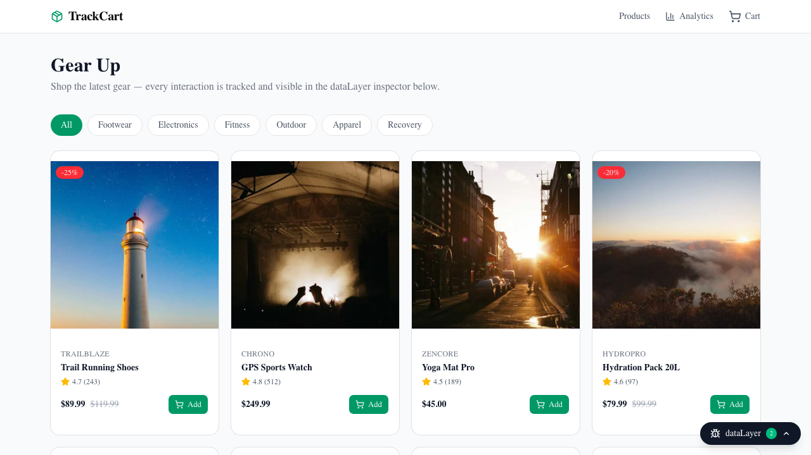
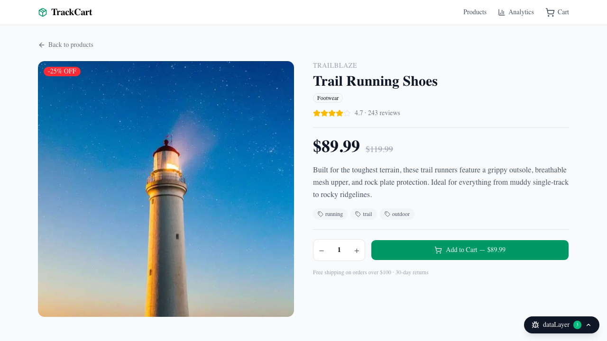
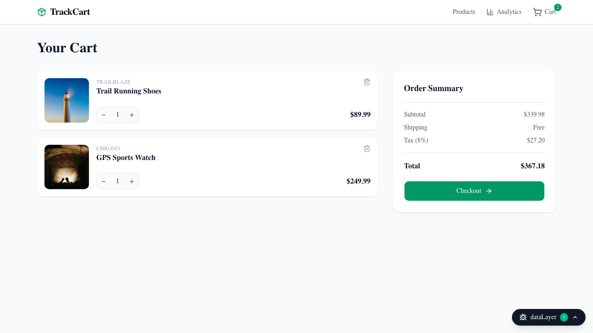
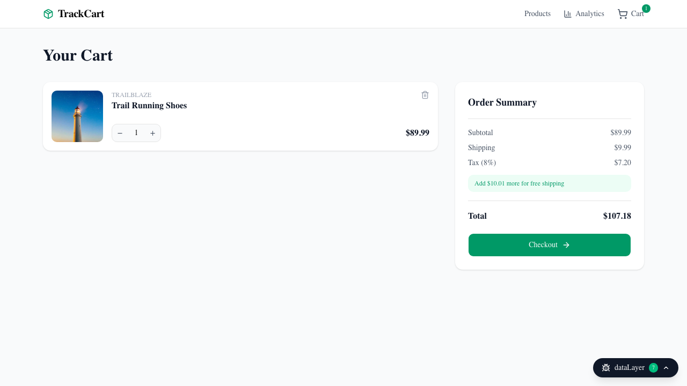
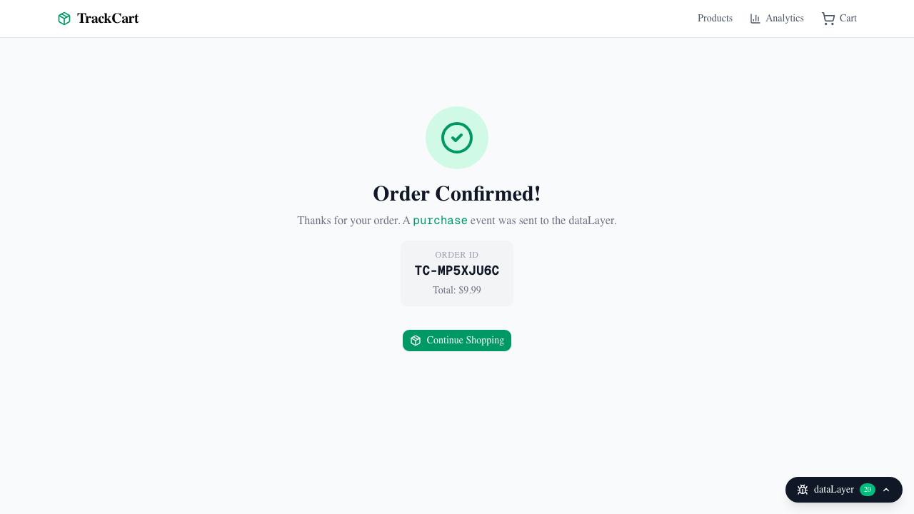
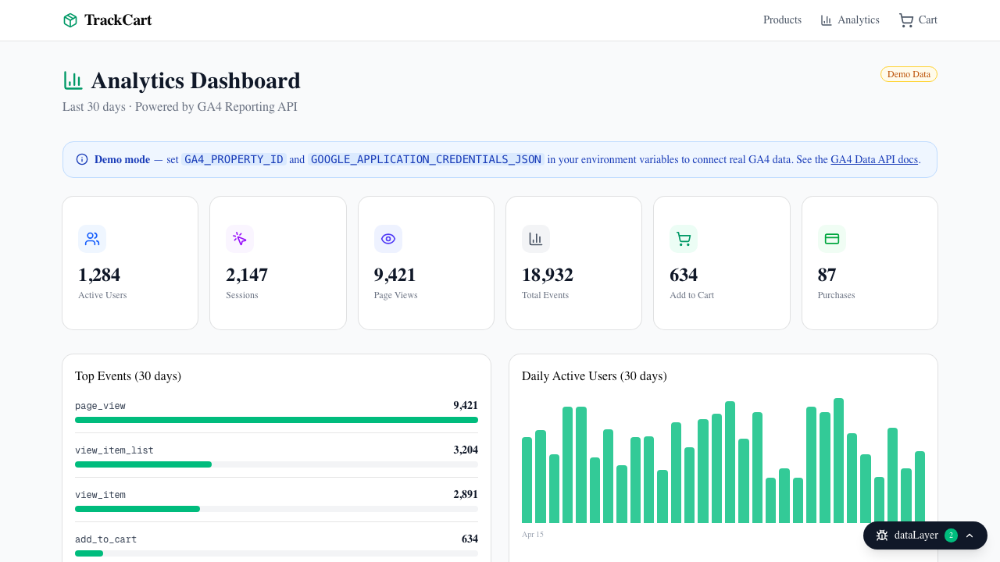
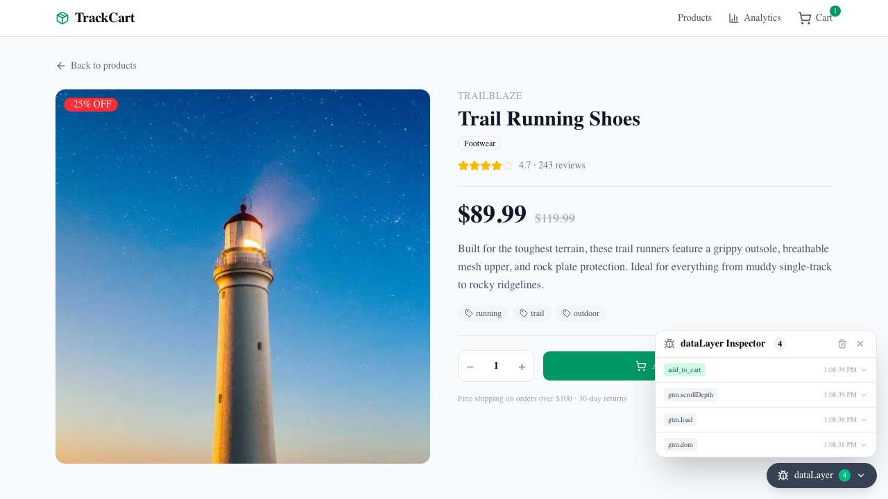

# TrackCart

A full-stack mock e-commerce store built to demonstrate end-to-end digital analytics implementation — Google Tag Manager, GA4 Enhanced E-commerce event tracking, and a live analytics dashboard powered by the GA4 Reporting API.

**Live demo:** https://trackcart.vercel.app

---



---

## What This Demonstrates

This project is purpose-built to showcase the skills required for digital analytics and tag management roles:

- **dataLayer architecture** — type-safe, spec-compliant GA4 Enhanced E-commerce event schema with ecommerce null clearing between events
- **GTM container implementation** — custom event triggers, GA4 event tags with ecommerce data layer integration
- **Full e-commerce event lifecycle** — `page_view`, `view_item_list`, `view_item`, `add_to_cart`, `remove_from_cart`, `begin_checkout`, `purchase`
- **Live QA tooling** — built-in dataLayer Inspector panel for real-time event debugging without browser dev tools
- **GA4 Reporting API dashboard** — server-side Next.js API route with live metrics, event breakdown, daily users chart, and e-commerce funnel

---

## Tech Stack

| Layer | Technology |
|-------|-----------|
| Framework | Next.js 16 App Router, React 19, TypeScript |
| Styling | Tailwind CSS v4, shadcn/ui |
| Tag Management | Google Tag Manager |
| Analytics | GA4 Enhanced E-commerce |
| Analytics Dashboard | GA4 Data API v1 (`@google-analytics/data`) |
| Testing | Playwright |
| Deployment | Vercel |

---

## Screenshots

### Product Listing
Category filtering fires a `view_item_list` event on every change.


### Product Detail
Fires `view_item` on load. Quantity selector adjusts the value passed to `add_to_cart`.



### Cart
Fires `remove_from_cart` on item removal and quantity decrements.



### Checkout
Fires `begin_checkout` on page load with the full item list.



### Order Confirmation
Fires `purchase` with a generated transaction ID, all items, tax, and shipping.



### Analytics Dashboard
Pulls live data from the GA4 Reporting API. Falls back to realistic demo data when credentials are not configured.



### dataLayer Inspector
A built-in debug panel that intercepts every `dataLayer.push()` call and displays the full event payload in real time — the same QA workflow used with GTM Preview.



---

## Event Tracking Implementation

All events follow the [GA4 Enhanced E-commerce specification](https://developers.google.com/analytics/devguides/collection/ga4/ecommerce). The ecommerce object is cleared before every push to prevent data bleed between events:

```javascript
// src/lib/dataLayer.ts
window.dataLayer.push({ ecommerce: null }); // clear previous ecommerce context

window.dataLayer.push({
  event: 'add_to_cart',
  ecommerce: {
    currency: 'USD',
    value: 89.99,
    items: [{
      item_id: 'p001',
      item_name: 'Trail Running Shoes',
      item_brand: 'TrailBlaze',
      item_category: 'Footwear',
      price: 89.99,
      quantity: 1,
    }]
  }
});
```

| Event | Trigger | Key Fields |
|-------|---------|-----------|
| `page_view` | Every route change | `page_title`, `page_location`, `page_path` |
| `view_item_list` | Listing load + category filter | `item_list_name`, `items[]` with `index` |
| `view_item` | Product detail page load | `currency`, `value`, `items[]` |
| `add_to_cart` | Add to Cart click | `currency`, `value`, `items[].quantity` |
| `remove_from_cart` | Cart item removal / qty decrement | `currency`, `value`, `items[].quantity` |
| `begin_checkout` | Checkout page load | `currency`, `value`, full `items[]` |
| `purchase` | Order form submission | `transaction_id`, `tax`, `shipping`, `items[]` |

---

## Getting Started

### Prerequisites

- Node.js 18+
- A Google account (for GTM + GA4 setup)

### Local Development

```bash
git clone https://github.com/connorkoch0511/TrackCart
cd TrackCart
npm install
cp .env.local.example .env.local
# Add your GTM container ID to .env.local
npm run dev
```

Open http://localhost:3000.

### Environment Variables

| Variable | Required | Description |
|----------|----------|-------------|
| `NEXT_PUBLIC_GTM_ID` | Yes | GTM container ID — e.g. `GTM-XXXXXXXX` |
| `GA4_PROPERTY_ID` | No | Numeric GA4 property ID for live analytics dashboard |
| `GOOGLE_APPLICATION_CREDENTIALS_JSON` | No | Service account JSON (single line) for GA4 Reporting API |

---

## GTM + GA4 Setup

### 1. Create a GA4 property

1. Go to [analytics.google.com](https://analytics.google.com) and create a new property
2. Add a Web data stream with your site URL
3. Copy the **Measurement ID** (`G-XXXXXXXXXX`)

### 2. Configure GTM

1. Go to [tagmanager.google.com](https://tagmanager.google.com) and create a container
2. Create a **Google Tag** with your GA4 Measurement ID — trigger: All Pages
3. For each event below, create a **GA4 Event** tag with **Send Ecommerce data → Data Layer**:

| Tag name | Event name | Trigger type |
|----------|-----------|--------------|
| GA4 - view_item | `view_item` | Custom Event: `view_item` |
| GA4 - add_to_cart | `add_to_cart` | Custom Event: `add_to_cart` |
| GA4 - begin_checkout | `begin_checkout` | Custom Event: `begin_checkout` |
| GA4 - purchase | `purchase` | Custom Event: `purchase` |

4. Publish the container, then add `NEXT_PUBLIC_GTM_ID=GTM-XXXXXXXX` to `.env.local`

### 3. Connect the Analytics Dashboard (optional)

To replace demo data with live GA4 metrics:

1. Enable the [Google Analytics Data API](https://console.cloud.google.com/apis/library/analyticsdata.googleapis.com) in Google Cloud Console
2. Create a service account and grant it **Viewer** access to your GA4 property
3. Download the JSON key file
4. Set `GA4_PROPERTY_ID` to your numeric property ID (found in GA4 Admin → Property Settings)
5. Set `GOOGLE_APPLICATION_CREDENTIALS_JSON` to the full JSON key content (as a single escaped line)

---

## Running Tests

```bash
# Install Playwright browsers (first time only)
npx playwright install chromium

# Run all e2e tests
npm run test:e2e

# Run with interactive UI
npm run test:e2e:ui

# View test report
npm run test:e2e:report
```

Tests cover the full e2e user journey and verify the dataLayer contract for every GA4 event.

---

## Project Structure

```
src/
├── app/
│   ├── page.tsx                  # Product listing — fires view_item_list
│   ├── products/[id]/page.tsx    # Product detail — fires view_item
│   ├── cart/page.tsx             # Cart management
│   ├── checkout/page.tsx         # Checkout — fires begin_checkout + purchase
│   ├── analytics/page.tsx        # GA4 Reporting API dashboard
│   └── api/analytics/route.ts   # Server-side GA4 Data API route
├── components/
│   ├── DataLayerInspector.tsx    # Live event debugger panel
│   ├── GTMProvider.tsx           # GTM script injection (next/script)
│   ├── Header.tsx                # Navigation with cart badge
│   └── ProductCard.tsx           # Product card with add-to-cart
├── context/
│   └── CartContext.tsx           # Cart state + localStorage persistence + dataLayer calls
├── lib/
│   ├── dataLayer.ts              # Type-safe GA4 event push utilities
│   └── products.ts               # Mock product catalog
└── types/
    └── index.ts                  # Shared TypeScript types
e2e/
├── home.spec.ts                  # Product listing + dataLayer events
├── product-detail.spec.ts        # Product detail + add_to_cart event
├── cart.spec.ts                  # Cart CRUD + remove_from_cart event
├── checkout.spec.ts              # Full checkout flow + purchase event
├── analytics.spec.ts             # Analytics dashboard rendering
└── datalayer.spec.ts             # GA4 Enhanced E-commerce contract tests
```
